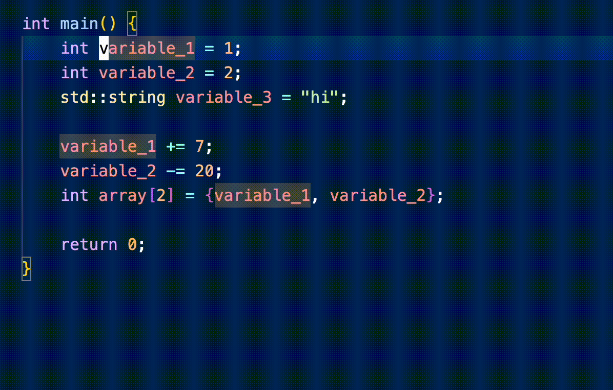
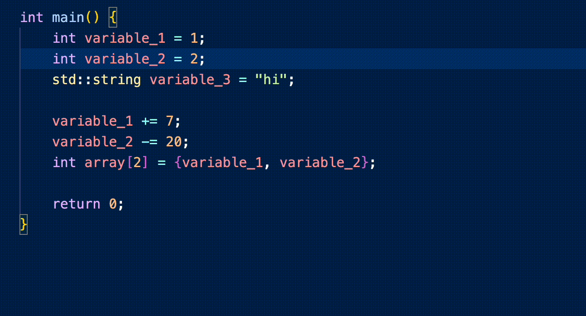

# quick-print README

This is an extension which allows you to quickly print things in C++ for the purpose of 
debugging.

The command "Quick Print Variable" (shortcut: alt+cmd+v) prints the name and value of the highlighted variable.





The command "Quick Print Line" (shortcut: alt+cmd+l) prints the line of code that the cursor is currently on.





You can edit the templates for printing variables and lines with the following configurations.
The keywords `QP_NAME`, `QP_VALUE`, and `QP_LINE` are substituted with the highlighted text or 
the current line.
```json
  "quickPrint.printVariableTemplates": {
    "cpp": "std::cout << \"QP_NAME: \" << QP_VALUE << \"\\n\";\n" // current default
  },
  "quickPrint.printLineTemplates": {
    "cpp": "std::cout << \"QP_LINE\" << \"\\n\";\n" // current default
  }
```

